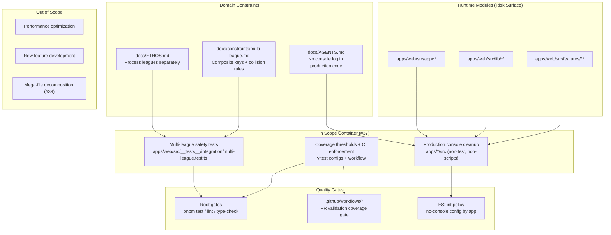

# Domain Map - Slice #37 Code Quality: Testing, Safety, Cleanup

Last updated: 2026-03-27 Session change: Initial domain map for slice #37
planning (grill-me stage).

## Container Spec

In scope

- Add or strengthen multi-league safety tests focused on ID-collision and
  separation invariants.
- Define and enforce coverage thresholds where missing, then gate them in CI.
- Remove or replace `console.log` in production runtime code paths (exclude
  tests and scripts).

Out of scope

- New product features.
- Performance optimization/refactors unrelated to #37 acceptance criteria.
- Mega-file decomposition tracked by slice #39.

Edge cases

- Same `matchup_id` and `roster_id` values across AFC and NFC in the same week.
- Empty or partial league data (one league returns no matchups).
- False positives from log cleanup in JSDoc examples, test files, and script
  paths.
- CI instability if thresholds are introduced without package-specific baseline
  tuning.

Constraints and invariants

- Process AFC/NFC independently and combine only at presentation layer.
- Composite keys must retain league context (`leagueId-week-matchupId`,
  `leagueId-rosterId`).
- Existing quality gates must continue to pass: `pnpm test`, `pnpm lint`,
  `pnpm type-check`.
- Keep changes minimal and aligned with existing repo patterns.

## Decision Log

- Use existing integration safety suite as the first extension point
  (`apps/web/src/__tests__/integration/multi-league.test.ts`) instead of
  creating a new test harness.
- Treat collision tests as mandatory acceptance checks, not optional regression
  coverage.
- Enforce coverage in two layers: package-level Vitest thresholds plus CI
  fail-on-threshold breach.
- Define "production code" for log cleanup as runtime source paths under
  `apps/*/src/**`, excluding tests and script directories.
- Preserve docs/JSDoc example logs unless they violate explicit lint policy;
  prioritize runtime executable code first.

## Accepted Risks

- Initial threshold values may require one follow-up tuning pass to avoid flaky
  failures while still enforcing quality.
- Some runtime modules may currently rely on console output for observability;
  replacing with structured logging may increase diff size in this slice.
- Broad grep-based log cleanup can remove useful diagnostics if scope filters
  are not strict; path-based targeting is required.
