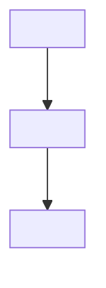

# System Map: <project>

> Updated by `/telos-review`. Edit when bounded context boundaries or
> system-level architecture changes. For slice-level detail, see
> `docs/domain/current-slice.md`.

## Bounded Context Inventory

| Context  | Owns | Depends On | Status                        |
| -------- | ---- | ---------- | ----------------------------- |
| `<name>` | ...  | ...        | active / planned / deprecated |

## System Diagram

## Cross-Context Flows

<!-- Data or events that cross bounded context boundaries -->

| Flow | From | To  | What crosses |
| ---- | ---- | --- | ------------ |
| ...  | ...  | ... | ...          |

## System-Wide Invariants

<!-- Rules that hold across all contexts. Violations anywhere are system bugs. -->

- ...

## Zoom Levels Available

<!-- List all docs/domain/*.md files and what zoom level they represent -->

| File               | Zoom      | Description                               |
| ------------------ | --------- | ----------------------------------------- |
| `current-slice.md` | deepest   | Active slice spec — replaced each session |
| `<context>.md`     | mid       | Bounded context detail                    |
| `system.md`        | this file | Full system map                           |
